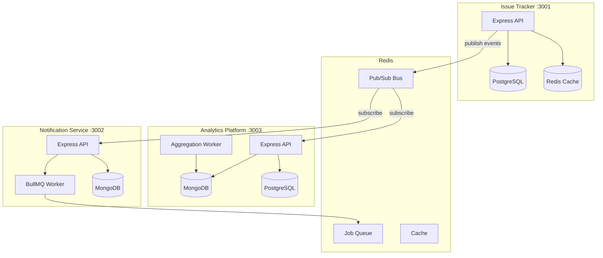

# Backend Platform

A backend monorepo with three interconnected services communicating via Redis pub/sub, built with Node.js and Express.

## Architecture



## Services

| Service | Port | Stack |
|---|---|---|
| Issue Tracker | 3001 | PostgreSQL, Redis |
| Notification Service | 3002 | MongoDB, Redis (BullMQ) |
| Analytics Platform | 3003 | MongoDB, PostgreSQL, Redis |

## Setup

```bash
git clone https://github.com/kirtan78/backend-platform.git
cd backend-platform
cp .env.example .env
```

Start infrastructure:

```bash
docker-compose up -d postgres mongodb redis
```

Install dependencies and run migrations:

```bash
npm install
cd apps/issue-tracker && npm run migrate
cd ../analytics-platform && npm run migrate
```

Seed demo data and start services:

```bash
cd apps/issue-tracker && npm run seed
npm start   # repeat for each service
```

Run tests:

```bash
cd apps/issue-tracker && npm test
```

## Project Structure

```
backend-platform/
├── apps/
│   ├── issue-tracker/           # Multi-tenant issue tracking (RBAC, cursor pagination, AI summaries)
│   ├── notification-service/    # Event-driven notification processing (BullMQ, dead letter queue)
│   └── analytics-platform/     # Metrics aggregation and billing (subscriptions, feature gating)
├── packages/
│   ├── config/                  # Environment validation
│   ├── logger/                  # Structured logging
│   ├── db/                      # Postgres, MongoDB, Redis clients
│   ├── auth/                    # JWT, bcrypt, RBAC middleware
│   ├── types/                   # Event constants, shared types
│   └── utils/                   # Pagination, retry, helpers
├── infra/docker/                # Per-service Dockerfiles
├── docs/                        # Architecture and ER diagrams
├── docker-compose.yml
└── .env.example
```

## Tech Stack

- **Runtime:** Node.js, Express
- **Databases:** PostgreSQL, MongoDB, Redis
- **Queue:** BullMQ
- **Auth:** JWT + bcrypt
- **Validation:** Joi
- **Testing:** Jest, Supertest
- **Containerization:** Docker, Docker Compose
