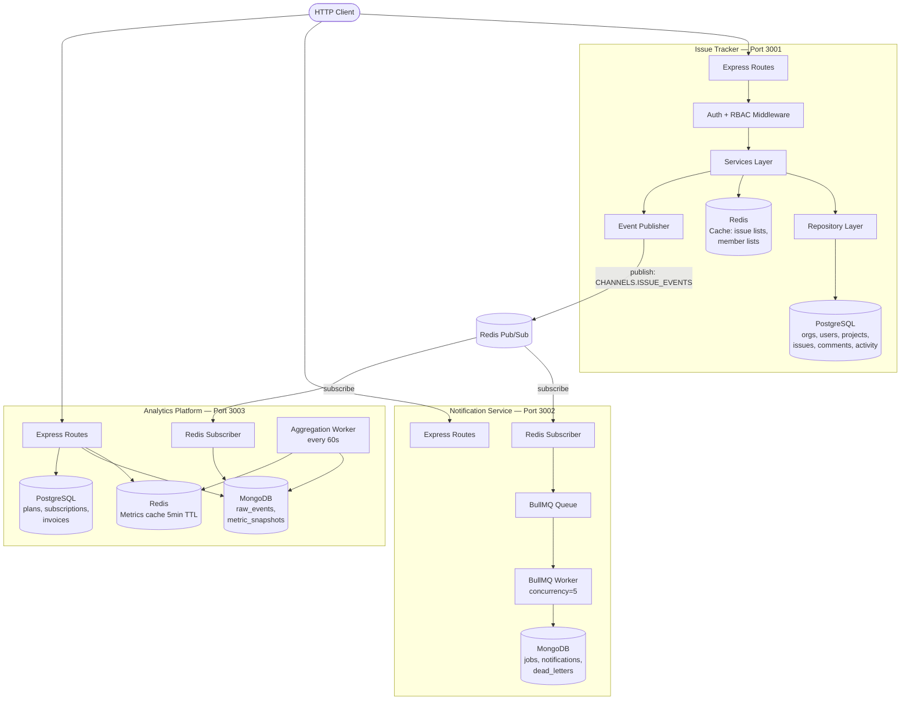
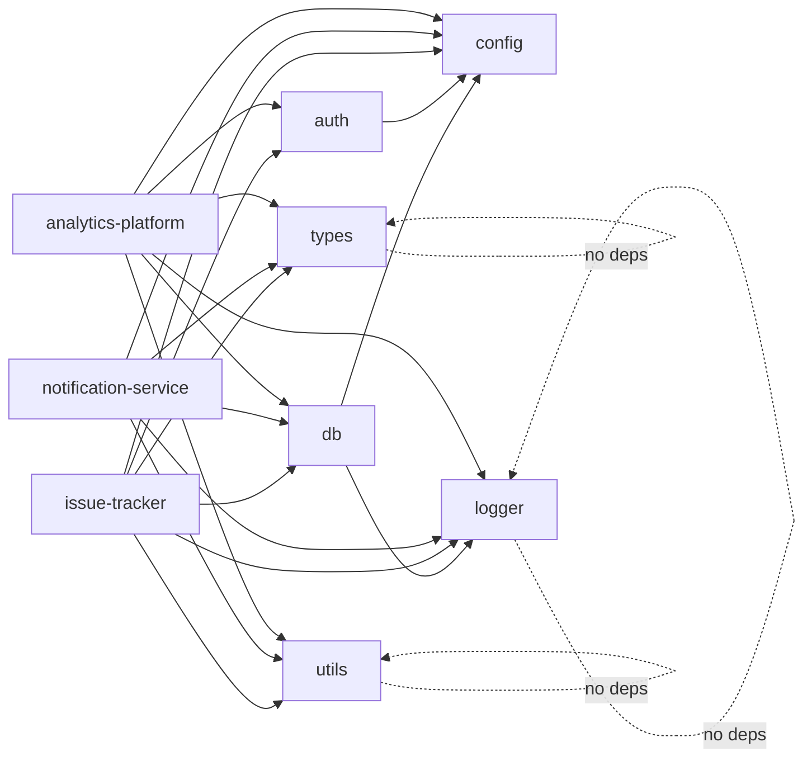
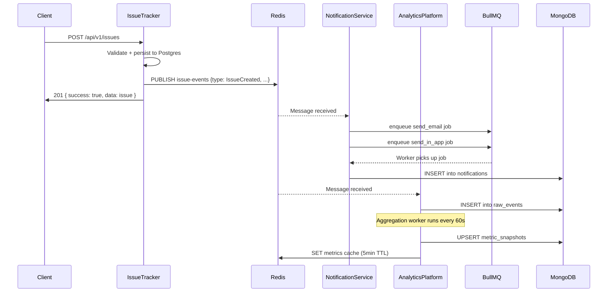

# System Architecture

## Overview

The Backend Engineering Platform is a monorepo containing three production-style microservices that communicate via a Redis pub/sub event bus. Each service is independently startable, has its own database(s), and can be scaled horizontally without changes to other services.

## Service Map



## Layered Architecture (per service)

Each service follows a strict 3-layer architecture:

```
HTTP Request
    ↓
Controller (translate HTTP → function call, return HTTP response)
    ↓
Service (business logic — validation, orchestration, caching, events)
    ↓
Repository (database queries — no logic, just data access)
    ↓
Database
```

**Why this separation matters:**
- Controllers never access the database directly — if they did, business logic would leak into HTTP handlers
- Services never import Express objects — they're testable in isolation
- Repositories are the only place SQL lives — swap to an ORM by replacing only this layer

## Shared Package Dependency Graph



No circular dependencies. `config` and `logger` are foundational — everything else builds on them.

## Event Flow



## Multi-Tenancy Model

Every request is scoped to an organization. The `loadOrgMembership` middleware verifies the requesting user is a member of the target org before any service logic runs. Every database query includes `org_id` in the WHERE clause — no cross-tenant data leakage is possible at the query level.

The middleware resolves `orgId` from four sources in priority order: route params → request body → query string → `req.user.orgId`. This covers all HTTP verb patterns: POST/PATCH send `orgId` in the body; GET requests send it as `?orgId=` in the query string.

```
Request → authenticate (JWT) → loadOrgMembership (resolve orgId from params/body/query, verify membership) → service → repository (all queries WHERE org_id = ?)
```
