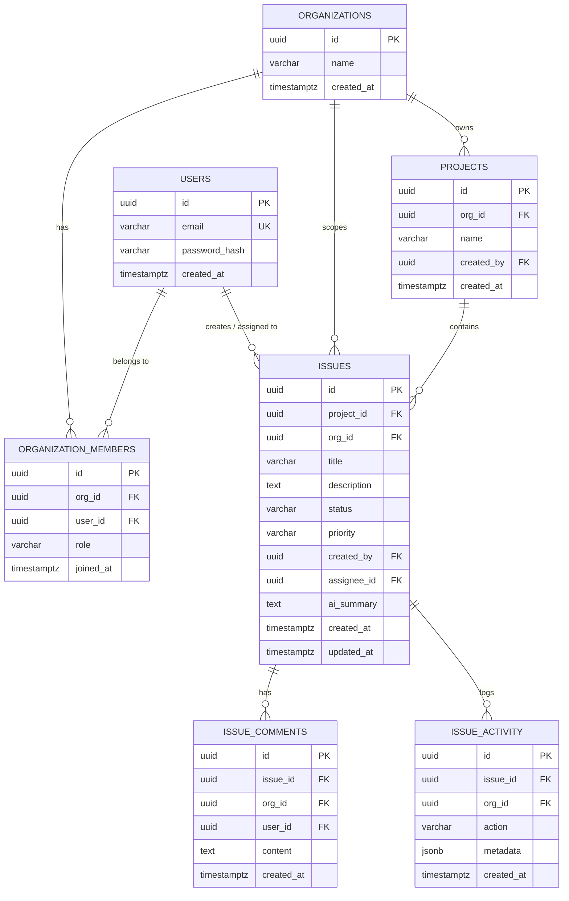
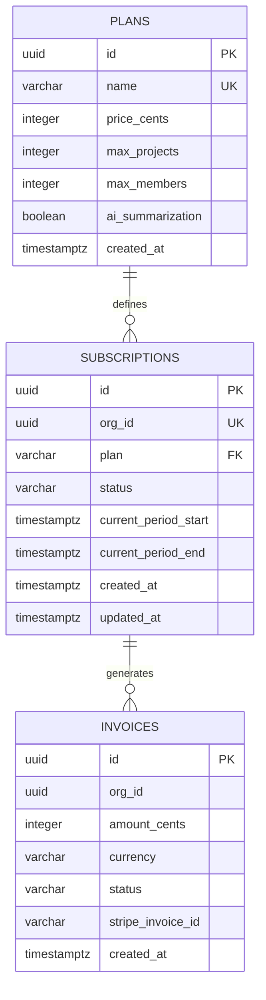

# Entity-Relationship Diagrams

## Issue Tracker (PostgreSQL)



## Analytics Platform (PostgreSQL — Billing)



## MongoDB Collections

### Notification Service

**jobs**
```json
{
  "_id": "ObjectId",
  "type": "send_email | send_in_app | send_webhook",
  "status": "pending | processing | completed | failed | dead",
  "payload": {},
  "attempts": 0,
  "maxAttempts": 3,
  "lastError": null,
  "bullmqJobId": "string",
  "processedAt": "Date",
  "completedAt": "Date",
  "createdAt": "Date",
  "updatedAt": "Date"
}
```

**notifications**
```json
{
  "_id": "ObjectId",
  "orgId": "uuid",
  "userId": "uuid",
  "type": "email | in_app | webhook",
  "eventType": "IssueCreated | ...",
  "title": "string",
  "body": "string",
  "metadata": {},
  "read": false,
  "deliveredAt": "Date",
  "createdAt": "Date"
}
```

**dead_letters**
```json
{
  "_id": "ObjectId",
  "originalJobId": "string",
  "jobType": "string",
  "payload": {},
  "errorHistory": [{ "attempt": 1, "error": "...", "failedAt": "Date" }],
  "reason": "Max retry attempts exhausted",
  "createdAt": "Date"
}
```

### Analytics Platform

**raw_events**
```json
{
  "_id": "ObjectId",
  "type": "IssueCreated | IssueUpdated | ...",
  "orgId": "uuid",
  "actorId": "uuid",
  "projectId": "uuid",
  "issueId": "uuid",
  "payload": {},
  "receivedAt": "Date"
}
```

**metric_snapshots**
```json
{
  "_id": "ObjectId",
  "orgId": "uuid",
  "date": "2024-01-15",
  "dau": 12,
  "eventCounts": { "IssueCreated": 5, "IssueUpdated": 8 },
  "totalEvents": 13,
  "computedAt": "Date"
}
```
